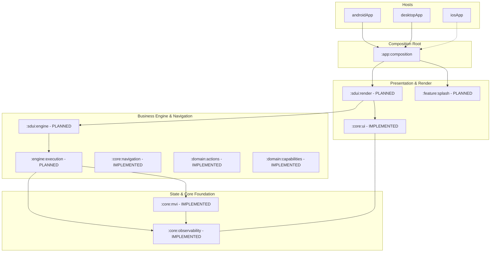

# CarBroz Partner — Multiplatform Architecture & Onboarding Map

Welcome to **CarBroz Partner**, a greenfield, multiplatform, Server-Driven UI (SDUI) application built using Kotlin Multiplatform (KMP) and Compose Multiplatform.

This repository implements a Clean Architecture + MVI + UDF state machine designed to run with equal parity across **Android**, **iOS**, and **Desktop (JVM)** targets.

---

## 1. Project Overview & Architectural Vision

CarBroz Partner empowers automotive service partners, workshops, and mechanics to manage bookings, service jobs, KYC verification, earnings, and customer communications.

### Core Architectural Laws
- **Kotlin Multiplatform + Compose Multiplatform**: Shared business logic, state machines, and UI components across Android, iOS, and Desktop.
- **Clean Architecture**: Strict separation of Presentation (`:core:ui`, `:sdui:render`), Application (`:engine:execution`), Domain (`:domain:*`, `:core:mvi`), and Infrastructure (`:infrastructure:*`).
- **MVI + UDF (Model-View-Intent + Unidirectional Data Flow)**: Immutable `StateFlow`-based state containers (`Store<State, Intent, Effect>`).
- **Server-Driven UI (SDUI)**: **100% of post-Splash screens are driven dynamically by backend UI specifications.**
- **Zero Semantic Duplication**: Single-owner cross-cutting law enforcing canonical implementations for scaling, logging, state, and networking.

---

## 2. Core Technology Stack

- **Language & Toolchain**: Kotlin 2.4.10, JDK 21 LTS (`jvmToolchain(21)`).
- **UI Framework**: Compose Multiplatform 1.11.1 (Runtime, Foundation, Material 3, UI).
- **State & Concurrency**: `kotlinx.coroutines` 1.10.1 (`StateFlow`, `SharedFlow`, `Structured Concurrency`).
- **Android Target**: AGP 9.3.1, `compileSdk` 36, `minSdk` 24.
- **iOS Target**: Native iOS Xcode Host (`iosApp`) consuming KMP compiled framework targets (`iosArm64`, `iosSimulatorArm64`).
- **Desktop Target**: JVM Desktop Application (`desktopApp`).

---

## 3. Platform Model & Host Entry Points

CarBroz Partner consists of **3 platform host entry points** consuming shared application composition:

```
                  ┌──────────────────────────────┐
                  │      :app:composition        │
                  │   (Shared App Initialization) │
                  └──────────────┬───────────────┘
                                 │
         ┌───────────────────────┼───────────────────────┐
         ▼                       ▼                       ▼
┌──────────────────┐    ┌──────────────────┐    ┌──────────────────┐
│   :androidApp    │    │   :desktopApp    │    │      iosApp      │
│  (Android Host)  │    │  (Desktop Host)  │    │ (Native Xcode)   │
└──────────────────┘    └──────────────────┘    └──────────────────┘
```

### Host Entry Points & Composition Boundary
- **Android (`:androidApp`)**: `MainActivity` initializes shared app composition inside `ComponentActivity.setContent {}`.
- **Desktop (`:desktopApp`)**: `Main.kt` launches JVM window runtime inside `application { Window { ... } }`.
- **iOS (`iosApp`)**: Native Xcode Swift project calls `MainViewController()` exported by `:app:composition`.
- **Why `iosApp` is NOT a Gradle Subproject**: In KMP architecture, `iosApp` is a native iOS Xcode project located at the root. It relies on Xcode for iOS building, signing, and simulator execution.

---

## 4. Native vs. Dynamic UI Law

> [!IMPORTANT]
> **Splash/Launch is the ONLY native product screen in CarBroz Partner.**

Every screen rendered after Splash is **Server-Driven UI (SDUI)**:
- Login & OTP Verification
- Partner Onboarding & KYC
- Partner Dashboard & Home
- Service Bookings & Active Jobs
- Wallet, Earnings & Payouts
- Profile & Support Settings
- Dynamic Dialogs, Bottom Sheets & Overlays

**Law**: Developers MUST NOT build static native feature screens (e.g. `LoginRepository`, `OtpUseCase`, `WalletViewModel`). All post-Splash user flows are dynamically driven by backend specifications.

---

## 5. Repository Structure & Module Responsibility Map

```
CarBroz-Partner-New/
├── androidApp/               # Android Platform Host [IMPLEMENTED HOST]
├── desktopApp/               # Desktop JVM Host [IMPLEMENTED HOST]
├── iosApp/                   # Native iOS Xcode Project [IMPLEMENTED HOST]
├── app/
│   └── composition/          # Shared Composition Root [IMPLEMENTED]
├── core/
│   ├── observability/        # [IMPLEMENTED] Structured Logging & Redaction
│   ├── mvi/                  # [IMPLEMENTED] Multiplatform MVI Store Foundation
│   ├── ui/                   # [IMPLEMENTED] Adaptive Design Foundation
│   └── navigation/           # [IMPLEMENTED] Stateful Multiplatform Router
├── domain/
│   ├── actions/              # [IMPLEMENTED] Dynamic Action System Models
│   ├── capabilities/         # [IMPLEMENTED] Platform Capability Contracts
│   └── storage/              # Storage & Cache Domain Models [PLANNED]

├── engine/
│   └── execution/            # Runtime Action & Request Execution Engine [PLANNED]
├── sdui/
│   ├── engine/               # SDUI Schema Parser & Normalizer [PLANNED]
│   └── render/               # Compose SDUI Component Renderers [PLANNED]
├── feature/
│   └── splash/               # Native Splash / Launch Screen [PLANNED]
└── infrastructure/
    ├── network/              # Multi-transport Network Engine [PLANNED]
    ├── persistence/          # SqlDelight & KeyValue Storage [PLANNED]
    └── capabilities/         # Platform Capability Adapters (GPS, Camera, etc.) [PLANNED]
```

---

## 6. Dependency Direction & Layering Architecture



---

## 7. Detailed Subsystem Architectures & Runtime Flows

### 7.1 MVI + UDF State Architecture (`:core:mvi`) — *[IMPLEMENTED]*
- **Package Layout**: `com.carbroz.partner.core.mvi.store`
- **Flow**: `UI -> Intent -> Store -> Atomic Reducer Update -> StateFlow<State> -> Recomposition`.
- **Side Effects**: `Store -> Effect -> Host / Navigation / Capability`.
- **Contracts**:
  - `Store<State, Intent, Effect>`: Public state machine contract.
  - `DefaultStore`: Thread-safe coroutine implementation providing atomic updates, intent queueing, and structured effect dispatch.
  - `IntentScope`: Scoped execution environment for intent handlers.
  - **Programmer-Defect Protection**: Distinguishes recoverable domain errors from fatal programmer defects.

### 7.2 Adaptive UI Resolution Architecture (`:core:ui`) — *[IMPLEMENTED]*
- **Package Layout**:
  - `com.carbroz.partner.core.ui.adaptive.scaling` $\implies$ `AdaptiveScaleCalculator`, `AdaptiveScalePolicy`, `DesignReferenceSpace`
  - `com.carbroz.partner.core.ui.adaptive.context` $\implies$ `ResolutionContext`, `ResolutionAxis`, `WindowEnvironment`, `CurrentContainerConstraints`, `SafeAreaInsets`
  - `com.carbroz.partner.core.ui.adaptive.spec` $\implies$ `DimensionSpec`, `SpacingSpec`, `RadiusSpec`, `IconSizeSpec`, `TypographySpec`, `LayoutConstraintSpec`, `ParentLayoutChildSpec`
  - `com.carbroz.partner.core.ui.adaptive.resolver` $\implies$ `DimensionResolver`, `SpacingResolver`, `RadiusResolver`, `IconSizeResolver`, `TypographyResolver`
  - `com.carbroz.partner.core.ui.adaptive.policy` $\implies$ `InteractionTargetPolicy`
  - `com.carbroz.partner.core.ui.adaptive.result` $\implies$ `ResolutionResult`, `ResolvedDimension`
  - `com.carbroz.partner.core.ui.tokens` $\implies$ `TypedTokenResolvers`
- **Flow**: `Backend Spec -> ResolutionContext -> Focused Property Resolver -> AdaptiveScaleCalculator -> ResolvedDimension`.
- **Contracts**:
  - `ResolutionContext(axis, window, container)`: Snapshot of evaluation axis (`HORIZONTAL` vs `VERTICAL`), screen metrics (`WindowEnvironment`), and immediate parent container bounds (`CurrentContainerConstraints`).
  - `AdaptiveScaleCalculator`: Damped exponential scaling formula $V = B \cdot \text{clamp}\left(\left(\frac{A}{R}\right)^{\text{damp}}, \text{minScale}, \text{maxScale}\right)$ (default exponent $0.5$) with complete sanitization against `NaN`, `Infinity`, and negative values.
  - `DimensionSpec` & `ResolvedDimension`: Expresses `Fixed`, `Adaptive`, `Fraction`, `Fill`, `Wrap`, and `Token` while preserving explicit `Exact(Dp)`, `Fill`, and `Wrap` semantics.
  - `InteractionTargetPolicy`: Enforces hit target hit areas ($48\text{dp} \times 48\text{dp}$) without mutating element visual dimensions.

### 7.3 Structured Observability Architecture (`:core:observability`) — *[IMPLEMENTED]*
- **Flow**: `Caller -> StructuredLogger -> Redactor -> LogEvent -> LogSink`.
- **Categories**: `APP`, `LIFECYCLE`, `UI`, `MVI`, `SDUI`, `EXECUTION`, `WORKFLOW`, `NAVIGATION`, `NETWORK`, `SECURITY`, `ERROR`.
- **Redaction Engine**: Automatically redacts sensitive fields classified under `PII`, `FINANCIAL`, or `CREDENTIALS`.

### 7.4 Stateful Navigation Router Architecture (`:core:navigation`) — *[IMPLEMENTED]*
- **Package Layout**:
  - `com.carbroz.partner.core.navigation.destination` $\implies$ `NavDestination`
  - `com.carbroz.partner.core.navigation.stack` $\implies$ `NavEntry`, `NavStack`, `NavEntryIdGenerator`, `DefaultNavEntryIdGenerator`
  - `com.carbroz.partner.core.navigation.command` $\implies$ `NavCommand`, `PopToTarget`
  - `com.carbroz.partner.core.navigation.state` $\implies$ `NavState`
  - `com.carbroz.partner.core.navigation.result` $\implies$ `NavResult`
  - `com.carbroz.partner.core.navigation.router` $\implies$ `Router`, `DefaultRouter`
- **Flow**: `Caller / Execution Engine -> Router.execute(NavCommand) -> Mutex Serialization -> Stack Mutation -> StateFlow<NavState> -> UI / Render Host`.
- **Contracts**:
  - `NavDestination`: Immutable descriptor of dynamic route string and primitive parameter map.
  - `NavEntry`: Runtime instance model pairing a unique entry ID with a `NavDestination`.
  - `NavStack`: Immutable non-empty back stack container (guarantees size $\ge 1$).
  - `NavCommand`: Atomic stack mutation operations (`Push`, `Replace`, `Pop`, `PopTo`, `ResetTo`).
  - `PopToTarget`: Deterministic stack popping targeting either `ByEntryId` or top-most `ByRoute`.
  - `NavResult`: Typed outcome hierarchy (`Executed` vs `Rejected` variants like `CannotPopRoot`, `TargetNotFound`, `InvalidRoute`).
  - `Router` & `DefaultRouter`: Thread-safe, coroutine-mutex-serialized router implementation emitting structured telemetry under `LogCategory.NAVIGATION`.

### 7.5 Dynamic Action Domain Models (`:domain:actions`) — *[IMPLEMENTED]*
- **Package Layout**:
  - `com.carbroz.partner.domain.actions.model` $\implies$ `ActionId`, `ActionType`
  - `com.carbroz.partner.domain.actions.value` $\implies$ `ActionValue`, `ActionParameters`
  - `com.carbroz.partner.domain.actions.binding` $\implies$ `BindingExpression`
  - `com.carbroz.partner.domain.actions.spec` $\implies$ `ActionMetadata`, `ActionSpec`
- **Flow**: `Backend Spec / SDUI Parser -> ActionSpec -> ActionParameters -> ActionValue Tree -> Execution Engine`.
- **Contracts**:
  - `ActionId`: Value object wrapping runtime/instance identity strings.
  - `ActionType`: Open, backend-extensible action type wrapper (supports known constants like `navigation.push` and unknown backend action strings).
  - `BindingExpression`: Pure declarative representation of runtime binding expressions (e.g. `${session.partnerId}`).
  - `ActionValue`: Sealed, type-safe value tree (`Text`, `Integer`, `Decimal`, `Flag`, `Binding`, `Object`, `List`, `Null`). Preserves exact decimal string precision with zero dynamic `Any` usage.
  - `ActionParameters`: Immutable, defensively-copied container for parameter maps. Redacts parameter values in `toString()` for log security.
  - `ActionSpec`: Pure declarative specification composing `ActionId`, `ActionType`, `ActionParameters`, and `ActionMetadata`.

### 7.6 Platform Capability Domain Models (`:domain:capabilities`) — *[IMPLEMENTED]*
- **Package Layout**:
  - `com.carbroz.partner.domain.capabilities.core` $\implies$ `CapabilityResult`, `CapabilityFailure`
  - `com.carbroz.partner.domain.capabilities.permission` $\implies$ `Permission`, `PermissionState`, `PermissionGateway`
  - `com.carbroz.partner.domain.capabilities.location` $\implies$ `GeoCoordinate`, `LocationSnapshot`, `LocationPrecision`, `LocationGateway`
  - `com.carbroz.partner.domain.capabilities.camera` $\implies$ `CapturedImage`, `CameraGateway`
  - `com.carbroz.partner.domain.capabilities.media` $\implies$ `MediaType`, `SelectedMedia`, `MediaPickerGateway`
  - `com.carbroz.partner.domain.capabilities.document` $\implies$ `SelectedDocument`, `DocumentPickerGateway`
  - `com.carbroz.partner.domain.capabilities.connectivity` $\implies$ `ConnectivityState`, `ConnectivityGateway`
  - `com.carbroz.partner.domain.capabilities.clipboard` $\implies$ `ClipboardGateway`
  - `com.carbroz.partner.domain.capabilities.external` $\implies$ `ExternalUriLauncher`
  - `com.carbroz.partner.domain.capabilities.settings` $\implies$ `SettingsLauncher`
- **Flow**: `Execution Engine -> Domain Capability Gateway -> Infrastructure Adapter -> Platform Native API`.
- **Contracts**:
  - `CapabilityResult`: Universal sealed result hierarchy (`Success`, `Cancelled`, `Unavailable`, `Unsupported`, `Failure`).
  - `CapabilityFailure`: Structured failure code (`SERVICE_DISABLED`, `TIMEOUT`, `RESOURCE_EXHAUSTED`, `UNKNOWN`) without leaking platform `Throwable`.
  - `PermissionGateway`: Cross-platform permission state query and request boundary.
  - `LocationGateway`: One-shot location reading with strict non-finite value checks (`.isFinite()`).
  - `CameraGateway`, `MediaPickerGateway`, `DocumentPickerGateway`: Photo capture, media selection, and file selection gateways.
  - `ConnectivityGateway`: Continuous flow observation of network reachability (`CONNECTED` vs `DISCONNECTED`).

### 7.7 Target SDUI Hierarchy & Execution Pipeline — *[PLANNED]*
```
Screen Specification
  └─► Template Node
       └─► Component Node
            └─► SubComponent Node
                 └─► Child Node
                      └─► ChildrenData (Terminal Node)
```
- **Parse & Render Pipeline**: `Raw JSON Response -> Parse -> Validate -> Normalize -> Theme Context -> Immutable Screen Graph -> Compose Render`.
- **Dynamic Event Pipeline**: `Node Event -> EventRouter -> ActionDispatcher -> ActionExecutor -> Dynamic Request -> Network Transport -> Store Result -> Recompose`.

### 7.8 Request, Binding & Mapper Architecture — *[PLANNED]*
- **Context Owners**: Device Context, Session Context, Screen State, Form State, Workflow State, Action Result Context.
- **Binding Resolution**: `BindingResolver` interpolates scoped expressions (e.g. `${session.partnerId}`, `${form.phone}`).
- **Mapper Boundary**: Transport DTOs mapped to immutable Domain models before reaching Store or UI.

---

## 8. Practical Developer Guide: "Where Do I Add This?"

- **New Adaptive Scaling Property / Token Resolver?**
  $\implies$ Add focused resolver in [`:core:ui`](file:///d:/Android%20Projects/CarBroz-Partner-New/core/ui). Do NOT create `UiUtils.kt`.
- **New State Machine / Intent Handler?**
  $\implies$ Implement using [`:core:mvi`](file:///d:/Android%20Projects/CarBroz-Partner-New/core/mvi) `Store` contracts.
- **New Navigation Command or Router Extension?**
  $\implies$ Implement in [`:core:navigation`](file:///d:/Android%20Projects/CarBroz-Partner-New/core/navigation).
- **New Dynamic Action Model or Parameter Value Variant?**
  $\implies$ Implement in [`:domain:actions`](file:///d:/Android%20Projects/CarBroz-Partner-New/domain/actions).
- **New Platform Capability Contract (e.g. Bluetooth, Biometrics)?**
  $\implies$ Contract in [`:domain:capabilities`](file:///d:/Android%20Projects/CarBroz-Partner-New/domain/capabilities), platform adapter in `:infrastructure:capabilities`.
- **New Structured Log Category or Sensitive Field Redaction?**
  $\implies$ Update [`:core:observability`](file:///d:/Android%20Projects/CarBroz-Partner-New/core/observability).

---

## 9. Architecture Status Matrix

| Subsystem | Module | Status | Baseline Commit |
| :--- | :--- | :--- | :--- |
| Repository Bootstrap & Constitution | Root | **COMMITTED** | `a317fac`, `074552f` |
| Module Structure & Boundaries | Root / Settings | **COMMITTED** | `b07ecd9` |
| Structured Observability Foundation | `:core:observability` | **COMMITTED** | `e48d7d4` |
| Multiplatform MVI Foundation | `:core:mvi` | **COMMITTED** | `2a84bcd` |
| Adaptive Design Foundation | `:core:ui` | **COMMITTED** | `a1708e6` |
| Documentation Baseline | Root | **COMMITTED** | `2ccb65d` |
| Large-Scale Package Structural Refactor | `:core:ui`, `:core:mvi` | **COMMITTED** | `c902417` |
| Stateful Navigation Router | `:core:navigation` | **COMMITTED** | `3a0296f` |
| Dynamic Action Domain Foundation | `:domain:actions` | **COMMITTED** | `49d21ba` |
| Platform Capability Domain Foundation | `:domain:capabilities` | **IMPLEMENTED** | Current Phase |
| Execution Engine & SDUI | `:engine:execution`, `:sdui:*` | *PLANNED* | Future Phase |
| Infrastructure & Features | `:infrastructure:*`, `:feature:*` | *PLANNED* | Future Phase |


---

## 10. Important Architecture Documents

- [`ENGINEERING_CONSTITUTION.md`](file:///d:/Android%20Projects/CarBroz-Partner-New/ENGINEERING_CONSTITUTION.md): The supreme law of the CarBroz Partner repository.
- [`TESTING_GUIDE.md`](file:///d:/Android%20Projects/CarBroz-Partner-New/TESTING_GUIDE.md): Master executable verification guide and quality gates catalog.
