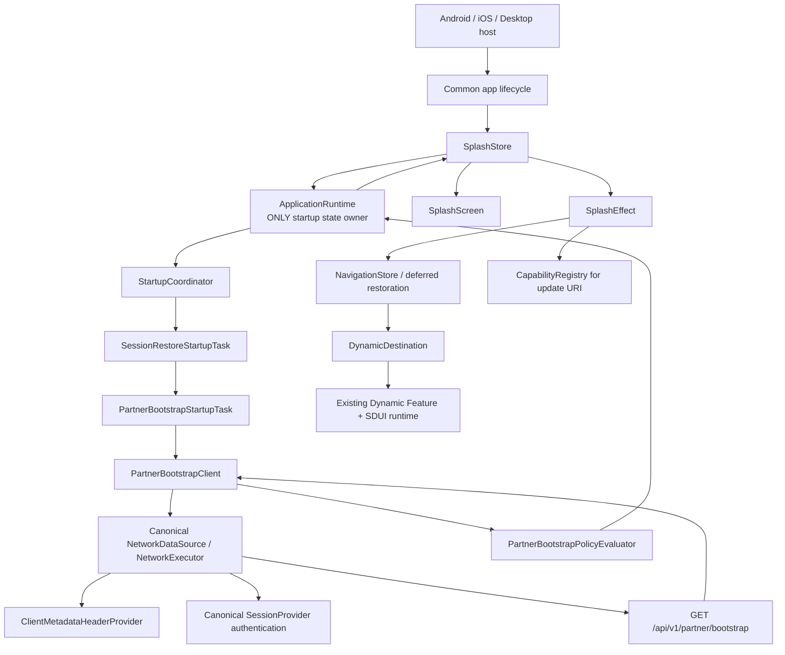
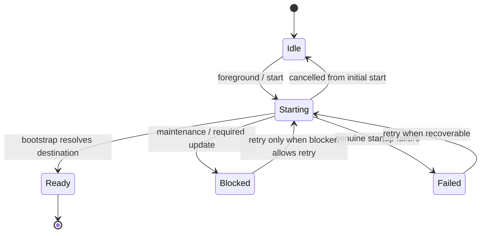
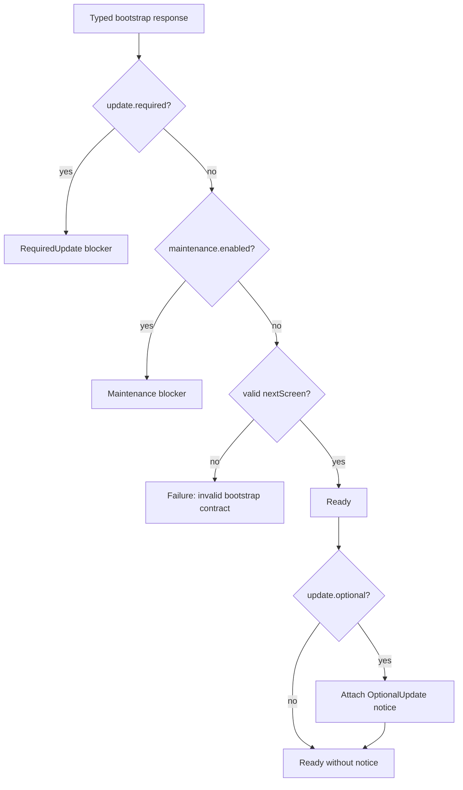
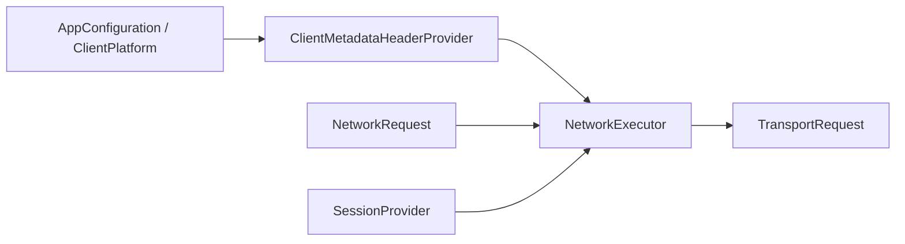
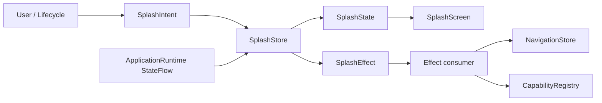
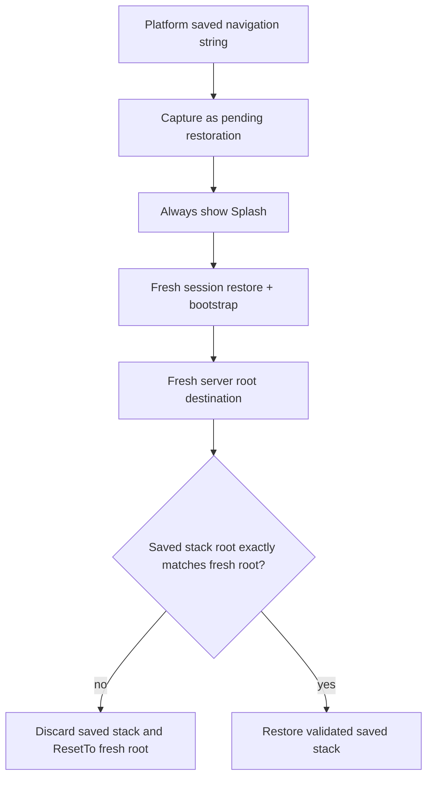
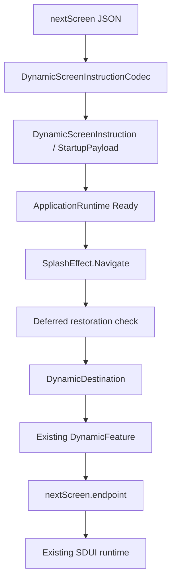

# CarBroz Partner — Splash & Startup Bootstrap Architecture

Status: **FROZEN IMPLEMENTATION CONTRACT**

This README is the source of truth for the static Splash and application-startup path. It must stay aligned with `docs/architecture/MASTER-ARCHITECTURE-CONSTITUTION.md`. If code and this document disagree, the implementation slice is not complete.

## 1. 60-second mental model

Splash is only the static presentation shown while the application runtime starts. It does not own networking, headers, session persistence, bootstrap JSON, update policy, navigation mechanics, feature flags, caching, or SDUI rendering.



The backend chooses the next product screen. The client validates and safely executes that decision.

---

## 2. Non-negotiable ownership rules

1. `runtime:application` is the **single canonical owner of startup state**.
2. `feature:splash` is **presentation only**.
3. `app:startup` owns Partner-specific startup orchestration and the Partner bootstrap HTTP contract.
4. `data:network` remains the single network execution stack.
5. `foundation:session` remains the single authentication/session owner.
6. `foundation:navigation` remains the single navigation mechanics owner.
7. `feature:dynamic` remains the single post-Splash backend-driven feature.
8. `runtime:sdui` remains the single SDUI validation/normalization/rendering engine.
9. No second bootstrap store, navigation stack, HTTP client, session snapshot, or remote-config cache is permitted.
10. Superseded startup/bootstrap classes are deleted in the same migration; old and new implementations may not remain in parallel.

---

## 3. Exact production structure

The implementation must match this structure exactly.

```text
feature/splash/
├── README.md
└── src/commonMain/kotlin/com/carbroz/feature/splash/
    ├── SplashContract.kt
    ├── SplashStore.kt
    └── SplashScreen.kt

app/startup/
├── build.gradle.kts
└── src/commonMain/kotlin/com/carbroz/partner/startup/
    ├── ClientMetadataHeaderProvider.kt
    ├── PartnerBootstrapContract.kt
    ├── PartnerBootstrapClient.kt
    ├── PartnerBootstrapPolicyEvaluator.kt
    ├── PartnerBootstrapStartupTask.kt
    └── SessionRestoreStartupTask.kt

runtime/application/
└── src/commonMain/kotlin/com/carbroz/runtime/application/
    ├── ApplicationRuntime.kt
    └── startup/
        ├── StartupTask.kt
        └── StartupCoordinator.kt
```

Existing supporting owners are reused, not duplicated:

```text
data/network/                 canonical network execution + header/auth policies
foundation/configuration/     environment/build/client platform metadata
foundation/session/           session restore, persistence, refresh, invalidation
foundation/navigation/        back stack and commands
feature/dynamic/              DynamicScreenInstruction + post-Splash feature
runtime/sdui/                 SDUI pipeline
app/composition/              DI + cross-feature wiring only
```

### Deleted production files

These old files must not exist after the migration:

```text
feature/splash/.../BootstrapConfiguration.kt
feature/splash/.../BootstrapConfigurationCache.kt
feature/splash/.../BootstrapModel.kt
app/composition/.../SessionRestoreStartupTask.kt
```

There is no replacement bootstrap cache. The new backend contract always returns current startup configuration.

---

## 4. Single-responsibility map

| Type | One responsibility |
|---|---|
| `SplashScreen` | Render static Splash state and emit UI callbacks only. |
| `SplashContract` | Define `SplashIntent`, `SplashState`, `SplashEffect`, and `SplashDestination`. |
| `SplashStore` | Translate lifecycle/UI intents and `ApplicationRuntimeState` into Splash state/effects. It does not call APIs. |
| `ApplicationRuntime` | Own the single observable startup lifecycle and retry policy. |
| `StartupCoordinator` | Execute ordered startup tasks and stop on final resolution/failure. |
| `SessionRestoreStartupTask` | Restore/repair the canonical persisted session, then continue startup. |
| `PartnerBootstrapClient` | Execute and decode `GET /api/v1/partner/bootstrap`. No UI/navigation/policy decisions. |
| `PartnerBootstrapPolicyEvaluator` | Purely evaluate typed bootstrap data into Ready, Required Update, or Maintenance. |
| `PartnerBootstrapStartupTask` | Thin orchestration: client -> policy -> `StartupTaskResult`. |
| `ClientMetadataHeaderProvider` | Attach trusted CarBroz client metadata headers centrally for network requests. |
| `NetworkExecutor` | Execute trusted requests with base URL, header policy, auth, timeout/retry/cache/observability. |
| `SessionStore` | Own authenticated session state. |
| `NavigationStore` | Own application navigation state. |
| `NavigationProcessStateBridge` | Capture process navigation state and apply it only after fresh bootstrap validates the root destination. |

---

## 5. Canonical runtime state model

There is no `BootstrapStore` and no parallel `BootstrapState`.



`ApplicationRuntimeState` must contain the complete trusted outcome needed by the Splash handoff:

```text
Idle
Starting(attempt)
Ready(attempt, payload, notices)
Blocked(attempt, blocker)
Failed(taskId, failure, attempt)
```

### Startup task results

```text
Continue
Resolved(
  Ready(payload, notices)
  OR
  Blocked(blocker)
)
Failure(reason)
```

Session restore returns `Continue`.
Partner bootstrap is the final resolver and returns `Resolved(...)` or a genuine `Failure(...)`.

If every configured task returns `Continue`, startup fails closed with `startup_missing_resolution`.

---

## 6. Update, maintenance, failure semantics

These meanings must stay separate.

```text
Required update -> valid server decision -> Blocked.RequiredUpdate -> startup cannot continue
Maintenance     -> valid server decision -> Blocked.Maintenance    -> retry may be allowed
Optional update -> non-blocking notice   -> Ready + OptionalUpdate notice
Network/parse/auth/etc. failure -> Failed
```

Maintenance and required update are **not** logged/modelled as startup failures.

Policy precedence for the current Partner contract is:



---

## 7. Partner bootstrap HTTP contract

### Request

```http
GET /api/v1/partner/bootstrap
X-CarBroz-Platform: ANDROID | IOS | DESKTOP
X-CarBroz-App-Version: <application version>
X-CarBroz-Build-Number: <build number>
Authorization: Bearer <access token>   # only when a valid local session exists
```

Bootstrap uses `NetworkAuthentication.OPTIONAL_SESSION`.

Request code must **not** manually create Authorization or client-metadata headers.

### Response envelope

```json
{
  "success": true,
  "message": "Partner bootstrap completed",
  "data": {
    "config": {
      "version": "1",
      "maintenance": {
        "enabled": false,
        "title": null,
        "message": null
      },
      "update": {
        "required": false,
        "optional": false,
        "minimumVersion": "1.0.0",
        "latestVersion": "1.0.0",
        "storeUrl": null
      },
      "features": {
        "registrationEnabled": true,
        "individualPartnerEnabled": true,
        "organizationPartnerEnabled": true
      }
    },
    "startup": {
      "authenticated": false,
      "nextScreen": {
        "screenId": "partner_login",
        "templateId": "partner_login_template",
        "templateType": "form_template",
        "endpoint": "/api/v1/partner/sdui/registry/partner_login",
        "method": "GET",
        "authentication": "NONE"
      }
    }
  },
  "traceId": "req-x"
}
```

Transport DTOs are decoded at the bootstrap client boundary and do not leak into Splash UI.

---

## 8. Header ownership

Client metadata is centralized through the existing `NetworkHeaderProvider` extension point.



`ClientMetadataHeaderProvider` owns:

```text
X-CarBroz-Platform
X-CarBroz-App-Version
X-CarBroz-Build-Number
```

`NetworkExecutor`/session infrastructure owns `Authorization`.

Request-specific code may not override provider-owned header names. `NetworkHeaderPolicy` must fail closed on collisions between provider headers and request headers.

---

## 9. Platform/build metadata

`foundation:configuration` remains the canonical process configuration owner.

`AppConfiguration` must include a semantic client platform:

```text
ClientPlatform.ANDROID
ClientPlatform.IOS
ClientPlatform.DESKTOP
```

Platform hosts/composition provide the value explicitly. No bootstrap code calls Android/iOS/Desktop APIs to discover platform identity.

---

## 10. Splash MVI/UDF contract

Splash presentation follows one direction only:



### Intents

```text
LifecycleChanged(state)
RetryClicked
UpdateClicked
```

There is no independent `Start` intent. Startup begins only after common lifecycle reports `Foreground`.

### State

```text
Loading
RequiredUpdate(title, message, updateUri)
Maintenance(title, message, retryEnabled)
Error(message, retryEnabled)
Ready
```

`SplashState` never exposes `ApplicationRuntimeState`, `StartupFailure`, network types, bootstrap DTOs, or session types.

### Effects

```text
Navigate(startupPayload)
OpenUpdateUri(uri)
```

Navigation and external-URI execution never bypass the Splash intent/effect path.

---

## 11. Static Splash UI for this slice

This migration intentionally does **not** freeze final visual design and adds no custom artwork.

The temporary Splash is a simple adaptive Material/CarBroz-theme screen containing approximately:

```text
CarBroz Partner
Welcome
Doorstep car care, ready when you are.
<progress while loading>
```

For blocked/error states it shows the server/policy message and the appropriate Retry/Update action.

Rules:

- no Canvas car artwork;
- no private hardcoded brand color palette;
- use `MaterialTheme` and existing CarBroz spacing/safe-area foundations;
- UI remains replaceable later without changing startup architecture.

---

## 12. Fresh bootstrap before navigation restoration

A saved dynamic destination must never bypass startup.

Current process state is captured first, but it is **not applied to `NavigationStore` before bootstrap**.



Compatibility is based on the fresh root `DynamicDestination.navigationId`. Malformed/unsafe/incompatible saved state is discarded atomically.

---

## 13. Authentication consistency

`foundation:session` remains the only local authentication truth.

Desired request semantics:

```text
No local session -> no Authorization -> guest bootstrap
Valid local session -> Authorization -> authenticated bootstrap
401 -> canonical auth recovery handles refresh/invalidation; bootstrap does not implement token logic
```

Bootstrap must never create, persist, refresh, or clear tokens itself.

---

## 14. Dynamic-screen handoff

The backend `nextScreen` is decoded using the existing `DynamicScreenInstructionCodec` and becomes the startup payload.



The client does not hardcode Login, Dashboard, KYC, Training, or other product flow names.

---

## 15. Dependency direction

Allowed:

```text
feature:splash -> runtime:application + foundation presentation/lifecycle primitives
app:startup -> runtime:application + data:network + foundation:configuration/session + feature:dynamic contract
app:composition -> app:startup + feature:splash + feature:dynamic + foundation/runtime/data modules for wiring
```

Forbidden:

```text
feature:splash -> data:network
feature:splash -> data:preferences
feature:splash -> Ktor
feature:splash -> session persistence
feature:splash -> Partner bootstrap DTOs
runtime:application -> Partner-specific code
foundation:* -> app:startup
```

---

## 16. Required tests

### `runtime:application`

- ordered `Continue -> Resolved` execution;
- startup stops after resolution;
- missing resolution fails closed;
- Required Update/Maintenance are blocked outcomes, not failures;
- retry rules for recoverable failure and retryable maintenance;
- cancellation restores the previous stable state;
- concurrent `start()`/`retry()` remain serialized.

### `app:startup`

- correct endpoint and `OPTIONAL_SESSION`;
- successful common-envelope decode;
- malformed/missing body fails closed;
- offline/timeout/transport/HTTP failure mapping;
- required update precedence;
- maintenance handling;
- optional update is non-blocking;
- valid `nextScreen` resolves Ready;
- invalid next-screen endpoint/method/authentication fails closed;
- client metadata header values;
- bootstrap request itself contains no manually attached metadata/Auth headers;
- session restore success/corrupt snapshot/storage failure behavior.

### `feature:splash`

- Foreground starts runtime once;
- Background cancels active startup work;
- duplicate Foreground does not duplicate startup;
- runtime Ready -> `Ready` state + one Navigate effect;
- runtime Required Update -> state;
- UpdateClicked -> one OpenUpdateUri effect;
- runtime Maintenance -> state;
- RetryClicked respects runtime retry semantics;
- runtime Failure -> clean UI Error state;
- no runtime/network/bootstrap type leaks into public Splash presentation state.

### navigation restoration

- captured saved dynamic stack is not applied before bootstrap;
- compatible saved root is restored after bootstrap;
- incompatible/malformed saved state is discarded and fresh root is used.

### network header policy

- provider metadata headers are present;
- request cannot override provider-owned headers;
- Authorization remains transport/session owned.

---

## 17. End-to-end acceptance flow

Guest launch:

```text
App foreground
-> Splash visible
-> session restore: signed out
-> GET /api/v1/partner/bootstrap
-> backend returns partner_login
-> runtime Ready
-> Splash Navigate effect
-> Reset/restore decision
-> GET /api/v1/partner/sdui/registry/partner_login
-> existing SDUI validation/rendering
```

Authenticated launch:

```text
App foreground
-> Splash visible
-> session restored
-> bootstrap request automatically carries Bearer token
-> backend returns authenticated nextScreen
-> runtime Ready
-> same dynamic-screen pipeline
```

Blocked launch:

```text
required update -> Splash RequiredUpdate -> UpdateClicked -> capability opens trusted URI
maintenance -> Splash Maintenance -> RetryClicked -> runtime retry
```

---

## 18. Change safety / non-impact boundary

This slice may change startup contracts and wiring only where required by the ownership correction. It must not redesign:

```text
runtime:sdui hierarchy/rendering
dynamic action execution
form runtime
business screen definitions
Room/database architecture
realtime architecture
background execution
analytics/observability foundations
navigation reducer mechanics
session persistence format
```

The existing canonical `NetworkExecutor`, `SessionStore`, `NavigationStore`, `DynamicFeature`, `DynamicScreenInstructionCodec`, and `SduiRuntime` are reused rather than replaced.

---

## 19. Freeze gate

The slice is complete only when all are true:

1. Production structure matches Section 3 exactly.
2. Old bootstrap/cache/store files and stale dependencies/tests are deleted.
3. `feature:splash` has no networking/preferences dependency.
4. `ApplicationRuntime` is the only startup-state owner.
5. Required update and maintenance are blocked outcomes, not failures.
6. Headers are centralized and protected from request override.
7. Splash follows Intent -> Store -> State/Effect UDF.
8. Dynamic navigation cannot restore before fresh bootstrap.
9. New Partner bootstrap tests pass.
10. Runtime, Splash, network, composition, navigation and existing SDUI tests pass.
11. Android, Desktop and iOS Kotlin compilation/build checks pass where the environment supports them.
12. Repository-wide stale-reference search finds no old `/api/v1/app`, `BootstrapStore`, `BootstrapConfigurationCache`, or `BootstrapConfigurationStartupTask` production path.
13. `docs/architecture/18-dynamic-runtime-architecture.md` is updated so it no longer documents the superseded dual-store `/api/v1/app` flow.
14. Final code-vs-this-README audit reports no intentional divergence.
